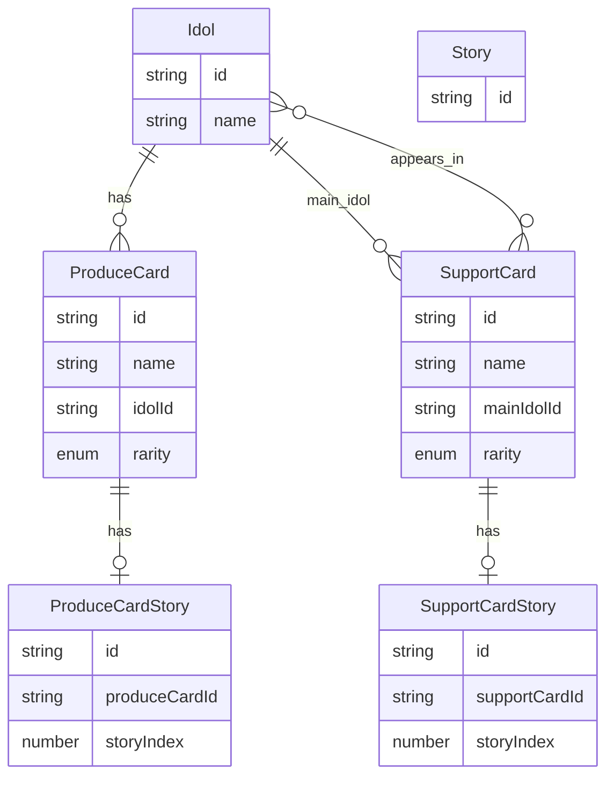
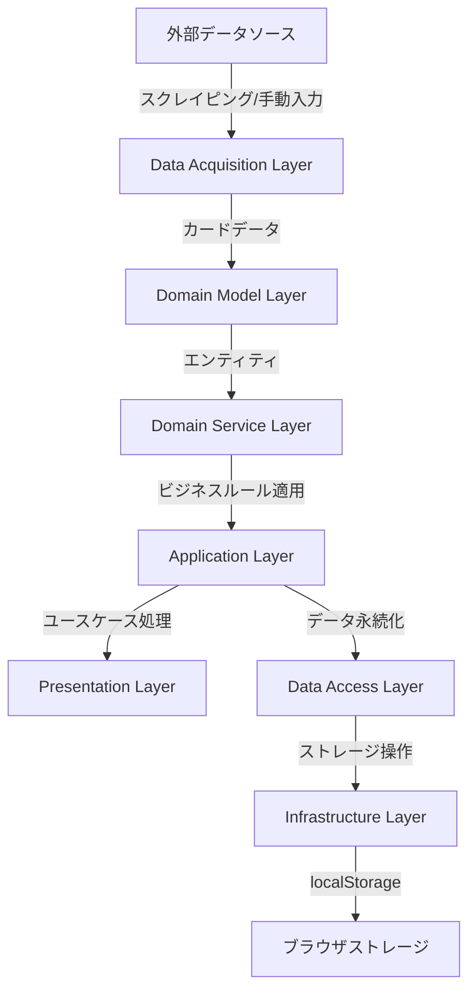
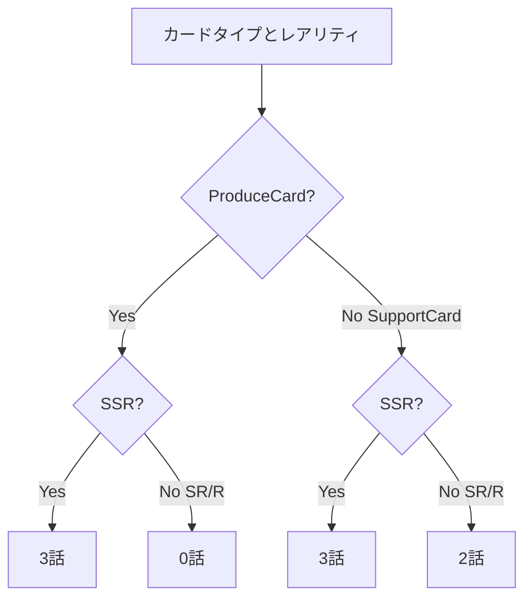

# データモデルの詳細

## エンティティ関係図（ER図）



**注意**: MermaidのER図では継承関係を直接表現できないため、以下の点を説明文で補足します：

- `IdolCard`は`ProduceCard`と`SupportCard`の共通基底型として定義されています
  - 共通属性（`id`, `name`, `rarity`）を定義しています
  - `ProduceCard`と`SupportCard`は`IdolCard`を継承しています
  - ER図では`ProduceCard`と`SupportCard`に直接属性を記載していますが、実際には`IdolCard`から継承された属性です
- `Story`はすべてのストーリータイプの基底型（抽象エンティティ）として定義されています
- `ProduceCardStory`と`SupportCardStory`は`Story`を継承しています
- 実装では`StoryRepository.getAllStories()`や`findById()`などで`Story`型として統一して扱われます

## 各エンティティの詳細説明

### Idol（アイドル）

ゲーム内に登場するキャラクター。

**属性:**

- `id: string` - アイドルのユニークID
- `name: string` - アイドルの名前

**リレーションシップ:**

- 1人のIdolは複数のProduceCardを持つことができる (1:0..\*)
- 1人のIdolは複数のSupportCardの主アイドルになることができる (1:0..\*)
- 1人のIdolは複数のSupportCardに登場人物として登場することができる (1:0..\*)

### ProduceCard（プロデュース・カード）

アイドルの様子を描いたカードの一種。1人のアイドルに紐づく。`IdolCard`を継承しています。

**継承関係:**

- `IdolCard`を継承している
- 共通属性（`id`, `name`, `rarity`）は`IdolCard`から継承される

**属性:**

- `id: string` - カードのユニークID（`IdolCard`から継承）
- `name: string` - カード名（`IdolCard`から継承）
- `rarity: 'SSR' | 'SR' | 'R'` - レアリティ（`IdolCard`から継承）
- `idolId: string` - 対象となるアイドルのID（必須、1:1）

**リレーションシップ:**

- 1枚のProduceCardは1人のIdolに紐づく (1:1)
- 1枚のProduceCardは0〜3個のProduceCardStoryを持つ (1:0..3)
  - SSR: 3個
  - SR: 0個
  - R: 0個

**所持状態の管理:**

- **設計方針**: ProduceCard型の内部には所持状態のフィールドを持たない（分離型設計）
- **理由**:
  - 外部データ（`ExternalGameData`）とユーザー固有の状態（所持/未所持）を分離するため
  - 外部データの更新時にユーザーの所持状態を独立して保持できるため
  - ドメインモデル（ProduceCard）とアプリケーション状態（所持状態）の責務を分離するため
- **実装**: 所持状態は`LocalStorageData.cardOwnership: Record<string, boolean>`として別途管理される
  - キー: カードID（`produceCard.id`）
  - 値: 所持状態（`true` = 所持、`false` = 未所持）
- **管理方法**: `useCardOwnership` composableを通じて所持状態を管理する

### SupportCard（サポート・カード）

アイドルの様子を描いたカードの一種。主のアイドルの他に、登場人物として他のアイドルも複数人出てくることがある。`IdolCard`を継承しています。

**継承関係:**

- `IdolCard`を継承している
- 共通属性（`id`, `name`, `rarity`）は`IdolCard`から継承される

**属性:**

- `id: string` - カードのユニークID（`IdolCard`から継承）
- `name: string` - カード名（`IdolCard`から継承）
- `rarity: 'SSR' | 'SR' | 'R'` - レアリティ（`IdolCard`から継承）
- `mainIdolId: string` - 主となるアイドルのID（必須、1:1）
- `appearingIdolIds: string[]` - 登場人物として登場するアイドルのIDリスト（0..\*）

**リレーションシップ:**

- 1枚のSupportCardは1人のIdolを主アイドルとして持つ (1:1)
- 1枚のSupportCardは0人以上のIdolに登場人物として登場する (1:0..\*)
- 1枚のSupportCardは2〜3個のSupportCardStoryを持つ (1:2..3)
  - SSR: 3個
  - SR: 2個
  - R: 2個

**所持状態の管理:**

- **設計方針**: SupportCard型の内部には所持状態のフィールドを持たない（分離型設計）
- **理由**:
  - 外部データ（`ExternalGameData`）とユーザー固有の状態（所持/未所持）を分離するため
  - 外部データの更新時にユーザーの所持状態を独立して保持できるため
  - ドメインモデル（SupportCard）とアプリケーション状態（所持状態）の責務を分離するため
- **実装**: 所持状態は`LocalStorageData.cardOwnership: Record<string, boolean>`として別途管理される
  - キー: カードID（`supportCard.id`）
  - 値: 所持状態（`true` = 所持、`false` = 未所持）
- **管理方法**: `useCardOwnership` composableを通じて所持状態を管理する

### IdolCard（アイドルカード）

`ProduceCard`と`SupportCard`の共通基底型。共通属性を定義しています。

**役割:**

- `ProduceCard`と`SupportCard`の共通基底型として機能
- 共通属性（`id`, `name`, `rarity`）を定義
- カードタイプに依存しない共通の操作を可能にする

**属性:**

- `id: string` - カードのユニークID
- `name: string` - カード名
- `rarity: 'SSR' | 'SR' | 'R'` - レアリティ

**継承関係:**

- `ProduceCard`と`SupportCard`が`IdolCard`を継承している
- ER図では継承関係を直接表現できないため、各カードタイプに直接属性を記載している

### Story（ストーリー）

すべてのストーリータイプの基底型。将来の拡張用（親愛度コミュ、育成シナリオ、初星コミュ、イベントコミュなど）に対応するための抽象エンティティ。

**属性:**

- `id: string` - ストーリーのユニークID

**継承関係:**

- `ProduceCardStory`と`SupportCardStory`が`Story`を継承しています
- 実装では`StoryRepository.getAllStories()`や`findById()`などで`Story`型として統一して扱われます

**読了状態の管理:**

- **設計方針**: Story型の内部には読了/未読状態のフィールドを持たない（分離型設計）
- **理由**:
  - 外部データ（`ExternalGameData`）とユーザー固有の状態（読了/未読）を分離するため
  - 外部データの更新時にユーザーの読了状態を独立して保持できるため
  - ドメインモデル（Story）とアプリケーション状態（読了状態）の責務を分離するため
- **実装**: 読了状態は`LocalStorageData.readStatus: Record<string, boolean>`として別途管理される
  - キー: ストーリーID（`story.id`）
  - 値: 読了状態（`true` = 読了、`false` = 未読）
- **管理方法**: `useReadStatus` composableを通じて読了状態を管理する

### ProduceCardStory（プロデュース・カード・ストーリー）

ProduceCardに紐づくストーリー。`Story`を継承しています。

**属性:**

- `id: string` - ストーリーのユニークID（`Story`から継承）
- `produceCardId: string` - 紐づくProduceCardのID
- `storyIndex: number` - ストーリーのインデックス（1, 2, 3）

**リレーションシップ:**

- 1個のProduceCardStoryは1枚のProduceCardに紐づく (多:1)

### SupportCardStory（サポート・カード・ストーリー）

SupportCardに紐づくストーリー。`Story`を継承しています。

**属性:**

- `id: string` - ストーリーのユニークID（`Story`から継承）
- `supportCardId: string` - 紐づくSupportCardのID
- `storyIndex: number` - ストーリーのインデックス（1, 2, 3）

**リレーションシップ:**

- 1個のSupportCardStoryは1枚のSupportCardに紐づく (多:1)

## リレーションシップの詳細

### Idol と ProduceCard の関係

- **関係性**: 1対多（1:0..\*）
- **説明**: 1人のIdolは複数のProduceCardを持つことができる。1枚のProduceCardは必ず1人のIdolに紐づく。
- **実装**: ProduceCardに`idolId`属性を持たせる

### Idol と SupportCard の関係

- **主アイドルとの関係**: 1対多（1:0..\*）
  - 1人のIdolは複数のSupportCardの主アイドルになることができる
  - 1枚のSupportCardは必ず1人のIdolを主アイドルとして持つ
  - 実装: SupportCardに`mainIdolId`属性を持たせる

- **登場人物との関係**: 多対多（1:0..\*）
  - 1人のIdolは複数のSupportCardに登場人物として登場することができる
  - 1枚のSupportCardは0人以上のIdolに登場人物として登場する
  - 実装: SupportCardに`appearingIdolIds`配列属性を持たせる

### ProduceCard と ProduceCardStory の関係

- **関係性**: 1対多（1:0..3）
- **説明**: 1枚のProduceCardは0〜3個のProduceCardStoryを持つ。レアリティによってストーリー数が異なる。
- **実装**: ProduceCardStoryに`produceCardId`属性を持たせる

### SupportCard と SupportCardStory の関係

- **関係性**: 1対多（1:2..3）
- **説明**: 1枚のSupportCardは2〜3個のSupportCardStoryを持つ。レアリティによってストーリー数が異なる。
- **実装**: SupportCardStoryに`supportCardId`属性を持たせる

## ビジネスルール

### レアリティとストーリー数の関係

#### ProduceCardの場合

- **SSR**: 3個のProduceCardStoryを持つ
- **SR**: 0個のProduceCardStoryを持つ
- **R**: 0個のProduceCardStoryを持つ

#### SupportCardの場合

- **SSR**: 3個のSupportCardStoryを持つ
- **SR**: 2個のSupportCardStoryを持つ
- **R**: 2個のSupportCardStoryを持つ

### データの整合性ルール

1. ProduceCardの`idolId`は、存在するIdolのIDを参照している必要がある
2. SupportCardの`mainIdolId`は、存在するIdolのIDを参照している必要がある
3. SupportCardの`appearingIdolIds`の各要素は、存在するIdolのIDを参照している必要がある
4. ProduceCardStoryの`produceCardId`は、存在するProduceCardのIDを参照している必要がある
5. SupportCardStoryの`supportCardId`は、存在するSupportCardのIDを参照している必要がある
6. ProduceCardStoryの数は、ProduceCardのレアリティに応じた数である必要がある（SSR=3、SR=0、R=0）
7. SupportCardStoryの数は、SupportCardのレアリティに応じた数である必要がある（SSR=3、SR=2、R=2）

## データソースと取得方法

### ProduceCardとSupportCardの実データ

ProduceCardとSupportCardの実データは外部から取得する

**取得方法は未定**（以下のいずれかを採用予定）:

- **案1**: 外部Webサイトからのスクレイピング
- **案2**: 手動でデータ入力

データ構造設計時は、取得方法に依存しない設計とする（データ取得方法の変更に柔軟に対応できるようにする）。

### 外部データソースの構造

外部データソースは3つのJSONファイルに分割される：

1. **`idols.json`**: アイドル情報
   - 構造: `{ idols: Idol[] }`
   - 各`Idol`は`id`と`name`を持つ

2. **`produceCards.json`**: プロデュースカード情報
   - 構造: `{ produceCards: ProduceCard[] }`
   - 各`ProduceCard`は`id`, `name`, `idolId`, `rarity`を持つ

3. **`supportCards.json`**: サポートカード情報
   - 構造: `{ supportCards: SupportCard[] }`
   - 各`SupportCard`は`id`, `name`, `mainIdolId`, `appearingIdolIds`, `rarity`を持つ

### ストーリーの生成方針

**重要な設計判断**: ストーリー（ProduceCardStory, SupportCardStory）は外部JSONファイルには含まれない。

- **理由**: ストーリー数はレアリティとカードタイプから決定されるビジネスルールに基づいて計算可能なため、冗長性を避けるため
- **実装**: DataSource実装（ManualDataSource, ScrapingDataSource）が内部的に`storyCountCalculator`を使用して、カードデータからストーリーを生成する
- **ビジネスルール**:
  - ProduceCard: SSR=3話、SR・R=0話
  - SupportCard: SSR=3話、SR・R=2話

### データ取得層の設計

データ取得方法を抽象化するため、`IDataSource`インターフェースを定義する。これにより、スクレイピング実装と手動入力実装を切り替えることが可能になる。

## アーキテクチャレイヤーの詳細説明

### レイヤー構成

```text
┌─────────────────────────────────────┐
│ Presentation Layer (Components)      │ 既存: src/components/
└─────────────────────────────────────┘
              ↓
┌─────────────────────────────────────┐
│ Application Layer (Composables)      │ 既存: src/composables/
│ - ユースケースの処理                  │
└─────────────────────────────────────┘
              ↓
┌─────────────────────────────────────┐
│ Domain Service Layer                 │ 新規: src/utils/domain/
│ - ビジネスルール（レアリティと        │
│   ストーリー数の関係など）            │
└─────────────────────────────────────┘
              ↓
┌─────────────────────────────────────┐
│ Domain Model Layer                   │ 新規: src/types/domain/
│ - Idol, IdolCard, ProduceCard,       │
│   SupportCard, Story などのエンティティ│
│ - ゲーム固有の型定義                  │
└─────────────────────────────────────┘
              ↓
┌─────────────────────────────────────┐
│ Data Acquisition Layer               │ 新規: src/services/data-source/
│ - 外部データ取得の抽象化              │
│   - IDataSource (インターフェース)    │
│   - ScrapingDataSource (案1)         │
│   - ManualDataSource (案2)           │
└─────────────────────────────────────┘
              ↓
┌─────────────────────────────────────┐
│ Data Access Layer (Repository)       │ 既存: src/services/repository/
│ - データの永続化・取得                │
└─────────────────────────────────────┘
              ↓
┌─────────────────────────────────────┐
│ Infrastructure Layer (Storage)       │ 既存: src/services/storage/
│ - ローカルストレージ実装              │
└─────────────────────────────────────┘
```

### 全レイヤーの詳細説明

#### 1. Presentation Layer (UI Layer) - `src/components/`

- **責務**: ユーザーインターフェースの表示とユーザー操作の受け取り
- **内容**:
  - `StoryList.vue`: ストーリー一覧の表示
  - `StoryCard.vue`: カード単位でのストーリー表示
  - `StoryItem.vue`: 個別ストーリーの表示と読了状態の切り替え
  - `FilterPanel.vue`: フィルタリング機能（レアリティ、カードタイプ、未読のみなど）
  - `ExportImport.vue`: データのエクスポート/インポート機能
  - `StoryForm.vue`: 手動でストーリーを追加するフォーム
- **依存関係**: Application Layer (Composables) に依存
- **SOLID原則**: Single Responsibility Principle (SRP) - 各コンポーネントは単一の表示責任のみを持つ
- **状態**: **既存** - 既存のまま拡張

#### 2. Application Layer - `src/composables/`

- **責務**: ユースケースの処理とビジネスロジックの調整
- **内容**:
  - `useStories.ts`: ストーリーデータの管理（取得、フィルタリング、検索など）
  - `useReadStatus.ts`: 読了状態の管理（読み取り、更新、切り替えなど）
  - `useLocalStorage.ts`: ローカルストレージへの保存・読み込みの管理
- **依存関係**:
  - Domain Model Layer に依存（エンティティの型定義）
  - Domain Service Layer に依存（ビジネスルールの利用）
  - Data Access Layer に依存（データの永続化）
- **SOLID原則**:
  - Single Responsibility Principle (SRP) - 各composableは特定の機能領域のみを担当
  - Dependency Inversion Principle (DIP) - インターフェースに依存
- **状態**: **既存** - 既存のまま拡張

#### 3. Domain Service Layer - `src/utils/domain/`

- **責務**: ゲーム固有のビジネスルールの実装
- **内容**:
  - `storyCountCalculator.ts`: レアリティとカードタイプからストーリー数を計算する関数
    - ProduceCard: SSR=3話、SR・R=0話
    - SupportCard: SSR=3話、SR・R=2話
  - `cardValidator.ts`: カードデータの妥当性検証（レアリティとストーリー数の整合性チェックなど）
- **依存関係**: Domain Model Layer に依存（エンティティの型定義）
- **SOLID原則**: Single Responsibility Principle (SRP) - ビジネスルールのみを扱う
- **状態**: **新規** - 新規作成
- **判断**: **最小限** - ビジネスルールのみを分離。規模に対して過剰にならないよう最小限に

#### 4. Domain Model Layer - `src/types/domain/`

- **責務**: ゲーム固有のエンティティと型定義
- **内容**:
  - `idol.ts`: Idol エンティティの型定義
  - `card.ts`: IdolCard, ProduceCard, SupportCard の型定義
  - `story.ts`: Story, ProduceCardStory, SupportCardStory の型定義
  - `index.ts`: エンティティのエクスポート
- **依存関係**: なし（最下層のドメインモデル）
- **SOLID原則**:
  - Single Responsibility Principle (SRP) - 各エンティティは単一の概念を表現
  - Open/Closed Principle (OCP) - 拡張可能な設計（将来のストーリータイプ追加に対応）
- **状態**: **新規** - 新規作成
- **判断**: **必須** - ゲーム固有の概念を明確に分離することで可読性・保守性が向上

#### 5. Data Acquisition Layer - `src/services/data-source/`

- **責務**: 外部データソースからの取得を抽象化
- **内容**:
  - `IDataSource.ts`: データ取得のインターフェース定義
    - `fetchCards()`: カードデータの取得メソッド
    - `fetchIdols()`: アイドルデータの取得メソッド（将来の拡張用）
  - `ScrapingDataSource.ts`: スクレイピング実装（案1）
    - 外部WebサイトからHTMLを取得し、カード情報を抽出
  - `ManualDataSource.ts`: 手動入力実装（案2）
    - ユーザーが手動で入力したデータを取得
- **依存関係**:
  - Domain Model Layer に依存（エンティティの型定義）
  - Infrastructure Layer に依存（HTTPリクエストなど、必要に応じて）
- **SOLID原則**:
  - Dependency Inversion Principle (DIP) - インターフェースに依存し、実装は注入可能
  - Liskov Substitution Principle (LSP) - インターフェースの実装は置き換え可能
  - Open/Closed Principle (OCP) - 新しいデータ取得方法を追加しても既存コードを変更しない
- **状態**: **新規** - 新規作成
- **判断**: **推奨** - 取得方法の変更に柔軟に対応するため、インターフェースで抽象化

#### 6. Data Access Layer (Repository Layer) - `src/services/repository/`

- **責務**: データの永続化・取得の抽象化
- **内容**:
  - `IStoryRepository.ts`: ストーリーリポジトリのインターフェース（既存）
    - `getAllStories()`: 全ストーリーの取得
    - `getStoryById()`: IDによるストーリー取得
    - `saveStories()`: ストーリーの保存
  - `StoryRepository.ts`: ストーリーリポジトリの実装（既存）
    - ローカルストレージサービスを使用してデータの永続化
- **依存関係**:
  - Domain Model Layer に依存（エンティティの型定義）
  - Infrastructure Layer に依存（ストレージサービスの利用）
- **SOLID原則**:
  - Single Responsibility Principle (SRP) - データアクセスのみを担当
  - Dependency Inversion Principle (DIP) - インターフェースに依存
  - Liskov Substitution Principle (LSP) - インターフェースの実装は置き換え可能
- **状態**: **既存** - 既存のまま拡張

#### 7. Infrastructure Layer - `src/services/`

- **責務**: インフラストラクチャ関連の実装（ストレージ、エクスポートなど）
- **内容**:
  - **Storage Service** (`src/services/storage/`):
    - `IStorageService.ts`: ストレージサービスのインターフェース（既存）
      - `get()`: キーによる値の取得
      - `set()`: キーと値の設定
      - `remove()`: キーの削除
      - `clear()`: 全削除
    - `LocalStorageService.ts`: ローカルストレージの実装（既存）
      - ブラウザのlocalStorage APIをラップ
  - **Export Service** (`src/services/export/`):
    - `IExportService.ts`: エクスポートサービスのインターフェース（既存）
      - `exportToJson()`: JSON形式でのエクスポート
      - `exportToCsv()`: CSV形式でのエクスポート
      - `importFromJson()`: JSON形式からのインポート
      - `importFromCsv()`: CSV形式からのインポート
    - `ExportService.ts`: エクスポートサービスの実装（既存）
- **依存関係**: なし（最下層のインフラストラクチャ）
- **SOLID原則**:
  - Single Responsibility Principle (SRP) - 各サービスは単一の責任のみを持つ
  - Dependency Inversion Principle (DIP) - インターフェースに依存
  - Liskov Substitution Principle (LSP) - インターフェースの実装は置き換え可能
- **状態**: **既存** - 既存のまま使用

#### 8. Utility Layer - `src/utils/`

- **責務**: 汎用的なユーティリティ関数
- **内容**:
  - `parser.ts`: Wiki HTMLパーサー（既存）
    - HTMLからカード情報を抽出
  - `storyIdGenerator.ts`: ストーリーID生成（既存）
    - カードIDとストーリーインデックスからユニークIDを生成
- **依存関係**: Domain Model Layer に依存（エンティティの型定義）
- **SOLID原則**: Single Responsibility Principle (SRP) - 各ユーティリティ関数は単一の責任のみを持つ
- **状態**: **既存** - 既存のまま使用

### レイヤー間の依存関係の原則

- **依存の方向**: 上層レイヤーは下層レイヤーに依存するが、下層レイヤーは上層レイヤーに依存しない
- **インターフェースの活用**: 実装ではなくインターフェースに依存することで、実装の変更に柔軟に対応
- **ドメインモデルの独立性**: Domain Model Layer は他のレイヤーに依存しない純粋な型定義

### 分離しない判断

以下のレイヤーは、規模に対して過剰と判断し、**分離しない**：

- **Repository Pattern の細分化**: 既存の `repository/` で十分。カードリポジトリ、アイドルリポジトリなどに細分化しない
- **Use Case Layer**: Composables で十分に表現可能。専用のUse Case層は不要
- **DTO Layer**: ドメインモデルと同一で問題なし。専用のDTO層は不要
- **Factory Pattern**: 現時点では不要。エンティティの生成は通常のコンストラクタで十分
- **Event Layer**: 現時点では不要。イベント駆動アーキテクチャは規模に対して過剰

## データフロー図



## ストーリー数の制約ルール


